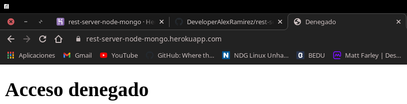
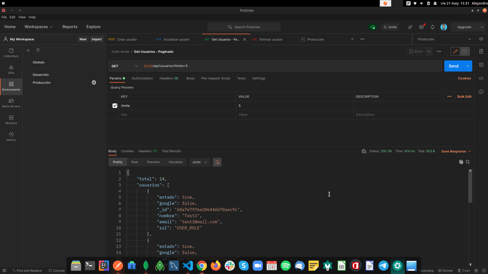
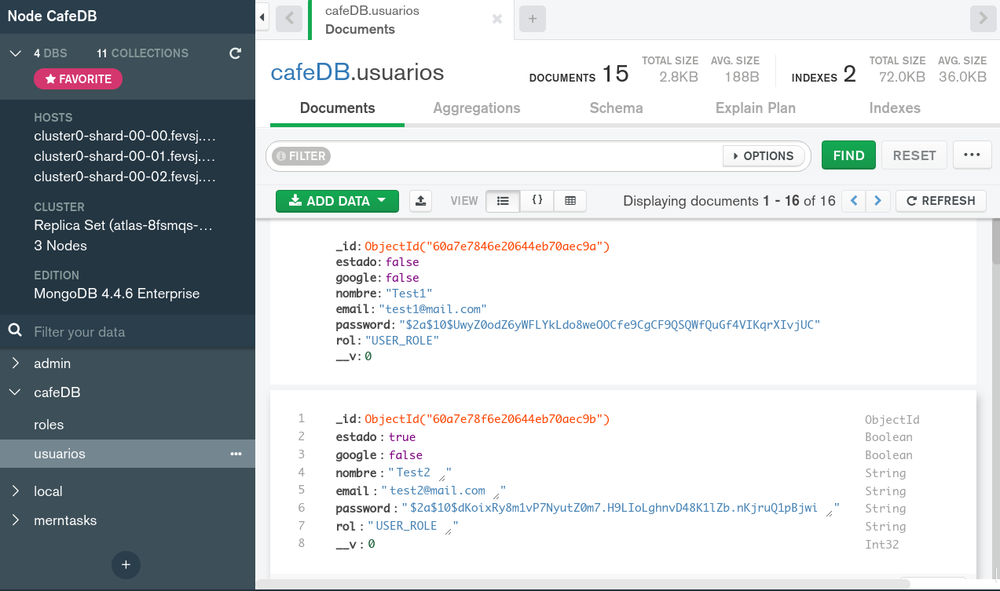

### Aplicación REST-SERVER

**Reconstruir los módulos de node**

```
npm install
```

---

**Este backend fue desplegado en Heroku**



---

**Pruebas realizadas en postman**



---

**Es un crud completo con validaciones, encriptación de contraseñas, validaciones de campos, validación de roles vs la base de datos, etc**


